# BaiduPCS-Rust

<div align="center">


🚀 基于 Rust + Vue 3 的高性能百度网盘客户端 | High-performance Baidu Netdisk client built with Rust and Vue 3

[功能特性](#-功能特性) • [快速开始](#-快速开始) • [技术栈](#️-技术栈) • [项目结构](#-项目结构) • [最新版本](#-最新版本) • [贡献](#-贡献)

</div>

---

## 📖 简介

BaiduPCS-Rust 是一个使用 Rust 和 Vue 3 构建的现代化百度网盘第三方客户端，提供简洁的 Web 界面和高效的上传/下载功能。

## ⭐ 支持项目发展

如果这个项目对你有帮助，请点一个 **Star** 支持！

<div align="left">

[](https://github.com/komorebiCarry/BaiduPCS-Rust/stargazers)

</div>

> 你的 Star 会让我更有动力持续更新 🚀

### 🎯 项目初衷

本项目主要是为了解决以下痛点：

- **NAS 环境下的下载速度问题**：虽然已经是百度网盘会员，但在 NAS 设备上使用官方百度网盘客户端无法实现满速下载，影响使用体验
- **高性能下载需求**：通过多线程并发下载、断点续传等技术，充分利用会员带宽，实现满速下载
- **自动备份功能**：支持将本地文件自动备份到百度网盘，实现数据的安全存储和同步
- **增强上传体验**：支持文件/文件夹上传、秒传能力与上传任务管理，让本地备份到网盘的过程更可控
- **跨平台支持**：支持 Windows、Linux、macOS 等多种平台，方便在不同设备上使用
- **现代化体验**：提供简洁美观的 Web 界面，支持实时进度显示和任务管理

### 🙏 致谢

本项目参考并受到了以下优秀项目的启发：

- [qjfoidnh/BaiduPCS-Go](https://github.com/qjfoidnh/BaiduPCS-Go) - BaiduPCS-Go 的增强版本，提供分享链接/秒传链接转存功能
- [GangZhuo/BaiduPCS](https://github.com/GangZhuo/BaiduPCS) - 百度网盘命令行客户端

感谢这些项目的开源贡献，为本项目的开发提供了重要参考。

---

## ✨ 功能特性

### 🔐 认证系统
- ✅ 二维码扫码登录（百度网盘 APP 扫码）
- ✅ **Cookie 登录**：支持直接粘贴浏览器 DevTools 中复制的完整 Cookie 字符串完成登录
- ✅ 自动会话管理
- ✅ 会话持久化
- ✅ 自动登录状态验证
- ✅ 失效自动跳转登录页
- ✅ **Web 访问认证**（可选，保护 Web 界面访问）
    - 密码保护：防止未授权访问
    - TOTP 双因素认证：支持 Google Authenticator 等应用
    - 恢复码机制：丢失 TOTP 设备时的备用登录方式

### 📁 文件管理
- ✅ 浏览网盘文件和目录
- ✅ 目录导航（面包屑）
- ✅ 文件列表展示（表格视图）
- ✅ 文件信息展示（名称、大小、时间、类型）

### ⬇️ 下载引擎
- ✅ 单文件下载（多线程并发下载，8 个并发分片，可配置）
- ✅ **文件夹下载**（递归下载整个文件夹，自动扫描并创建任务）
- ✅ **批量下载**（支持多文件/文件夹同时下载）
- ✅ **下载冲突策略**（支持覆盖、跳过、自动重命名，适用于单文件/文件夹/批量下载）
- ✅ 断点续传支持
- ✅ 速度限制（可配置）
- ✅ 实时进度显示（下载速度、进度百分比、ETA）
- ✅ 任务队列管理
- ✅ 暂停/继续/删除功能
- ✅ URL健康管理和智能淘汰策略
- ✅ **CDN链接刷新三层检测机制**（速度异常检测、线程停滞检测、定时强制刷新）
- ✅ **下载文件资源管理器**（选择下载目录，支持最近目录记忆）

### ⬆️ 上传引擎与任务管理
- ✅ 统一的上传任务列表视图（上传管理页面）
- ✅ 支持选择本地文件或文件夹发起上传（通过本地文件资源管理器）
- ✅ **批量上传**（支持多文件/文件夹同时上传）
- ✅ **上传冲突策略**（支持智能去重、自动重命名、覆盖，可设置全局默认值或单次覆盖）
- ✅ **统一上传按钮**（文件和文件夹使用同一个上传入口）
- ✅ 上传任务进度实时展示：已上传大小、总大小、上传速度、剩余时间（ETA）
- ✅ 任务控制：暂停/继续/重试/删除
- ✅ 秒传标识：支持后端秒传时，在任务上展示"秒传"标记
- ✅ **上传最近目录记忆**（自动记录最近使用的上传目录）

### 🎨 Web 界面
- ✅ 现代化 Vue 3 + Element Plus UI
- ✅ 响应式设计
- ✅ 实时状态更新
- ✅ 友好的用户体验
- ✅ 移动端适配

### 💻 本地文件资源管理器（上传文件选择器）
- ✅ 仿系统"资源管理器"的本地文件浏览体验
- ✅ 支持根目录、前进/后退、返回上一级、刷新等导航操作
- ✅ 支持文件/目录/文件或目录三种选择模式（根据上传场景配置）
- ✅ 支持分页加载和"加载更多"，适配大目录场景
- ✅ 提供空态/错误态 UI，操作失败可一键重试

### 🔗 转存功能
- ✅ **分享链接转存**（支持转存百度网盘分享链接到自己的网盘）
- ✅ 提取码验证（支持带提取码的分享链接）
- ✅ 转存后自动下载（可选，转存成功后自动创建下载任务）
- ✅ 转存任务管理（查看转存进度和状态）

### ⬇️ 离线下载
- ✅ **离线下载功能**（支持通过百度网盘服务器代为下载资源到网盘空间）
- ✅ 多种链接格式支持：HTTP/HTTPS、磁力链接（magnet）、ed2k 链接
- ✅ 磁力链接自动标准化（Base32 转十六进制）
- ✅ 任务管理：添加、查询、取消、删除离线下载任务
- ✅ 实时进度显示：通过 WebSocket 实时推送任务状态和进度更新
- ✅ **自动下载功能**：任务完成后可自动下载到本地，支持配置保存路径和每次询问路径选项
- ✅ 智能轮询机制：根据任务进度预测完成时间，动态调整轮询间隔（最小 3 分钟，最大 60 分钟）
- ✅ 任务详情查看：支持查看任务的完整信息，包括文件列表、保存路径、源链接等

### 🐳 部署支持
- ✅ Docker 一键部署
- ✅ Docker Compose 支持
- ✅ 多阶段构建优化

### 📡 实时与持久化能力
- ✅ 任务持久化与断点恢复
- ✅ WebSocket 实时推送
- ✅ 日志持久化与滚动

### 🌐 网络代理
- ✅ **HTTP 和 SOCKS5 代理支持**：支持配置代理服务器转发所有网络请求
- ✅ **代理认证**：支持用户名和密码认证
- ✅ **代理测试连接**：实时检测代理可用性和延迟
- ✅ **运行状态监控**：显示代理状态（正常/已回退到直连/探测中）、抖动次数、下次探测倒计时
- ✅ **自动回退机制**：代理故障时自动回退到直连模式，可配置是否允许回退
- ✅ **即时生效**：配置保存后立即生效，无需重启应用

### 🔄 自动备份
- ✅ **上传备份**（本地 → 云端）：自动将本地文件夹备份到百度网盘
- ✅ **下载备份**（云端 → 本地）：自动将云端文件同步到本地
- ✅ **文件系统监听**：实时检测本地文件变化（Windows 使用 ReadDirectoryChangesW）
- ✅ **定时轮询兜底**：防止监听遗漏，支持间隔轮询和指定时间全量扫描
- ✅ 备份配置管理：创建/编辑/删除配置、手动触发、禁用/启用
- ✅ 备份历史记录与 SQLite 持久化

### 🔐 客户端侧加密
- ✅ **AES-256-GCM 加密算法**：端到端加密保护文件隐私
- ✅ **支持普通上传和自动备份**：灵活选择是否启用加密
- ✅ 加密密钥管理：生成、导出、删除密钥
- ✅ 加密文件使用 `.dat` 扩展名隐藏真实文件类型
- ✅ 加密快照管理：记录映射关系，支持下载自动解密
- ✅ **文件管理原始文件名显示**：加密文件在文件列表中自动还原显示原始文件名

> ⚠️ **重要提示**：请务必妥善备份以下文件，否则已加密的文件将**无法解密**！
> - `config/encryption.json`：加密密钥文件（建议同时使用界面的"导出密钥"功能备份）
> - `config/baidu-pcs.db`：数据库文件，包含加密映射表（记录加密文件与原始文件名的对应关系）

### 🔓 独立解密工具 (decrypt-cli)

为了方便用户在没有主程序的情况下解密文件，我们提供了独立的命令行解密工具 `decrypt-cli`。

**特性：**
- ✅ 独立运行，无需启动主程序
- ✅ 支持批量解密和单文件解密
- ✅ 支持 AES-256-GCM 和 ChaCha20-Poly1305 算法
- ✅ 跨平台支持（Windows、Linux、macOS）

**下载：**
- 推荐从 [`decrypt-cli-v0.1.0` 专用发布页](https://github.com/komorebiCarry/BaiduPCS-Rust/releases/tag/decrypt-cli-v0.1.0) 直接下载对应平台的 `decrypt-cli` 可执行文件
- 也可以在项目的 [Releases 页面](https://github.com/komorebiCarry/BaiduPCS-Rust/releases) 中查看全部版本

<details>
<summary>📖 <b>decrypt-cli 使用说明</b>（点击展开）</summary>

#### 准备工作

解密前需要准备以下文件：
1. `encryption.json` - 加密密钥文件（从主程序导出或备份）
2. `mapping.json` - 加密映射文件（批量解密时需要，可从主程序导出）
3. 加密的文件（`.dat` 文件）

#### 批量解密模式

```bash
# 恢复原始目录结构（使用映射文件中的原始路径）
decrypt-cli decrypt --key-file encryption.json --map mapping.json --in-dir ./encrypted --out-dir ./decrypted

# 镜像输入目录结构（按 --in-dir 的目录结构输出）
decrypt-cli decrypt --key-file encryption.json --map mapping.json --in-dir ./encrypted --out-dir ./decrypted --mirror
```

#### 单文件解密模式

```bash
# 自动尝试所有密钥
decrypt-cli decrypt --key-file encryption.json --in file.dat --out file.txt

# 指定密钥版本
decrypt-cli decrypt --key-file encryption.json --in file.dat --out file.txt --key-version 2
```

#### 参数说明

| 参数 | 说明 |
|------|------|
| `--key-file` | 密钥配置文件路径（必需） |
| `--map` | 映射文件路径（批量模式必需） |
| `--in-dir` | 输入目录（批量模式） |
| `--out-dir` | 输出目录（批量模式） |
| `--in` | 单个输入文件（单文件模式） |
| `--out` | 单个输出文件（单文件模式） |
| `--key-version` | 指定密钥版本（单文件模式可选） |
| `--mirror` | 镜像输入目录结构，而不是恢复原始路径 |

</details>

<details>
<summary>📖 <b>加密映射原理说明</b>（点击展开）</summary>

#### 文件加密
- 每个文件加密后生成唯一的 UUID 文件名（如 `a1b2c3d4-xxxx.dat`）
- 映射关系：`加密文件名 → 原始文件名` 存储在数据库中

#### 文件夹加密映射
文件夹使用**路径感知**的加密映射策略：

**加密时（原始名 → 加密名）**：根据 `(父路径, 文件夹名)` 查询或生成 UUID
```
示例：
1. 首次遇到 /backup/a/docs：
   - 查询：parent=/backup/a, name=docs → 未找到
   - 生成新 UUID：abc-123-xxx
   - 保存映射：(/backup/a, docs) → abc-123-xxx

2. 首次遇到 /backup/b/docs：
   - 查询：parent=/backup/b, name=docs → 未找到
   - 生成新 UUID：def-456-xxx（不同路径，不同 UUID）
   - 保存映射：(/backup/b, docs) → def-456-xxx

3. 再次遇到 /backup/a/docs：
   - 查询：parent=/backup/a, name=docs → 找到 abc-123-xxx
   - 复用已有加密名（保持一致性）
```

**解密时（加密名 → 原始名）**：直接根据 UUID 查询，无需父路径（UUID 全局唯一）

这种设计确保：
- ✅ 不同路径下的同名文件夹使用不同的加密名，避免冲突
- ✅ 同一路径下的文件夹多次上传时复用同一加密名，保持一致性
- ✅ 解密时通过唯一的 UUID 直接还原原始文件夹名

</details>

---

## 📋 最新版本

### v1.12.1 (当前版本)

**问题修复：**
- 🐛 **修复下载管理器初始化时序问题**：将等待队列监控和触发器的启动延迟到 `persistence_manager` 设置完成后，避免后台任务捕获到 `None` 导致持久化失败
- 🐛 **修复下载管理批量继续/批量暂停文件夹状态未变更**：批量暂停/继续子任务后，同步更新对应文件夹的状态为 `Paused`/`Downloading`，确保前端文件夹状态正确推送
- 🐛 **修复分享直下临时文件夹重复创建**：分享直下模式跳过对 `save_path` 父目录的重复 `mkdir`，避免百度静默重命名（加时间戳后缀）；临时目录不再写入 `recent_save_path`

<details>
<summary><b>v1.12.0 / v1.11.2 / v1.11.1 / v1.11.0 / v1.10.0 / v1.9.1 / v1.9.0 / v1.8.1 / v1.8.0 版本详情</b>（点击展开）</summary>

#### v1.12.0

**新功能：**
- ✨ **新增 Cookie 登录**：支持直接粘贴浏览器 DevTools 复制的完整 Cookie 字符串完成登录
    - 解析 `BDUSS`/`PTOKEN`/`STOKEN` 等关键字段，验证通过后完整初始化所有管理器
    - 缺少 `PTOKEN` 时登录提示中明确说明受限功能，不阻断基础使用

**问题修复：**
- 🐛 **修复下载任务级槽位刷新节流器，所有分片共享**：同一任务所有分片共享同一 `SlotTouchThrottler`，防止分片切换时重置节流计时器；槽位分配后立即刷新，防止长准备阶段被误判超时
- 🐛 **修复白名单文件夹配置不生效问题，补充校验以改进安全性**
    - 新增 `FilesystemConfig::validate()` 方法，加载/保存配置时校验路径合法性
    - 修复 Windows 下裸驱动器根路径（`C:`/`C:\`/`C:/`）跳过白名单校验的 bug
    - 新增 `enforce_allowlist_on_followed_symlinks` 配置项防止符号链接绕过白名单
- 🐛 **白名单文件夹配置问题边界修复**：精确区分裸驱动器根路径与 drive-relative 路径，后者正确走 `canonicalize()` 流程
- 🐛 **文件夹下载进度问题修复**：新增 `completed_downloaded_size` / `failed_count` 字段，进度单调递增，失败子任务正确统计，支持从 `Failed` 状态恢复下载
- 🐛 **普通转存与分享直下目录结构统一修复**：分批转存按原始父目录名分组，本地目录结构与原始分享结构完全对应
- 🐛 **下载目录不存在提示**：启动时检查下载目录可访问性，目录不存在或无权限时输出清晰提示并优雅退出

#### v1.11.2

**问题修复：**
- 🐛 **修复转存异步不同目录同名文件分批处理**：分享直下选择跨目录同名文件时，自动分批转存避免百度 API `-30` 冲突
    - 检测跨目录同名文件冲突，按 basename 无冲突分组，逐批转存到 `group_N` 临时子目录
    - 修复取消语义、冲突恢复路径适配、部分批次失败警告持久化等多项问题
- 🔧 修复 `RefreshGuard` 生命周期标注警告

#### v1.11.1

**问题修复：**
- 🐛 **修复异步转存错误兜底**：补充百度异步转存 `taskquery` 失败场景的兜底处理
    - 识别 `task_errno` 并返回更明确的失败原因
    - 分享直下遇到 `task_errno=-30`（目标文件已存在）时，尝试恢复已转存结果
    - 减少"实际已转存但任务被误判失败"的情况

#### v1.11.0

**新功能：**
- ✨ **文件冲突策略**：系统设置新增上传/下载默认策略，单次上传和下载操作也可临时覆盖
    - 上传支持智能去重、自动重命名、覆盖
    - 下载支持覆盖、跳过、自动重命名
    - 文件、文件夹、批量任务和自动备份统一按策略处理同名文件

**问题修复：**
- 🐛 **修复异步转存兼容性**：兼容百度返回异步转存任务的场景

#### v1.10.0

**新功能：**
- ✨ **网络代理支持**：新增 HTTP 和 SOCKS5 代理配置功能
    - 支持 HTTP 代理和 SOCKS5 代理两种类型
    - 支持代理认证（用户名/密码）
    - 代理测试连接功能，实时检测代理可用性
    - 代理运行状态监控：显示代理状态（正常/已回退到直连/探测中）、抖动次数、下次探测倒计时
    - 自动回退机制：代理故障时自动回退到直连模式，可配置是否允许回退
    - 配置保存后立即生效，无需重启应用

**功能增强：**
- ✨ **批量任务操作**：下载和上传管理页面新增批量操作功能
    - 下载管理：支持批量暂停/继续所有活跃任务，批量清除已完成/失败任务
    - 上传管理：支持批量暂停/继续所有活跃任务，批量清除已完成/失败任务
- ✨ **文件监听能力检测**：自动备份设置页面新增文件监听能力状态卡片
- ✨ **设置页面优化**：系统设置页面新增锚点导航，支持快速跳转到各个设置分区

**问题修复：**
- 🐛 **修复自动备份大量文件卡顿问题**：优化任务列表查询，使用轻量级克隆跳过大字段，显著提升响应速度

#### v1.9.1

**功能增强：**
- ✨ **转存选择文件**：转存分享链接时支持选择需要转存的文件，不再强制转存全部文件
- ✨ **分享直下选择文件**：分享直下同样支持选择需要下载的文件
- ✨ **转存/分享直下批量下载**：转存和分享直下支持同时下载多个文件

**问题修复：**
- 🐛 **修复分片失败导致整个任务失败**：修复网络不好时上传/下载单个分片失败导致整个任务失败的问题

#### v1.9.0

**主要更新：**
- ✨ **分享直下功能**：支持粘贴百度网盘分享链接并选择本地下载目录，后端会在网盘临时目录中完成转存，下载完成后按配置自动清理临时文件，避免长期占用网盘空间
- ✨ **分享管理页面**：新增“分享管理”页面，集中查看我的分享记录，支持复制链接和提取码、单个/批量取消分享
- ✨ **独立解密工具 decrypt-cli**：新增独立命令行解密工具，可在未部署主程序的环境下解密加密文件，支持批量解密和单文件解密，兼容 AES-256-GCM 与 ChaCha20-Poly1305
- 🔧 **下载 0 速度场景修复**

#### v1.8.1

**问题修复：**
- 🐛 **修复任务槽超时释放问题**：新增槽位刷新节流器（`SlotTouchThrottler`），在任务进度更新时定期刷新槽位时间戳，防止正常任务因长时间无进度更新被误判为过期而释放
    - 下载任务和上传任务在进度回调中自动刷新槽位时间戳（30秒节流间隔）
    - 当槽位因超时被自动释放时，自动将对应任务状态设置为失败，并通过 WebSocket 通知用户
    - 解决了大文件下载/上传时，因进度更新间隔较长导致槽位被误释放的问题

#### v1.8.0

**主要新功能：**
- ✨ **离线下载功能**：支持通过百度网盘服务器代为下载资源
    - 支持 HTTP/HTTPS/磁力链接/ed2k 等多种下载链接格式
    - 磁力链接自动标准化（Base32 转十六进制）
    - 任务列表查询、详情查看、取消和删除
    - 实时进度显示和状态更新（WebSocket 推送）
    - **自动下载功能**：任务完成后可自动下载到本地（支持配置保存路径）
    - 智能轮询机制：根据任务进度动态调整轮询间隔，节省资源

**问题修复：**
- 🐛 **修复文件夹下载完成计数问题**：使用 `counted_task_ids` 集合避免重复计数，修复已完成任务从内存移除后进度显示错误的问题
- 🐛 **修复已取消文件夹仍显示在列表中**：取消文件夹时从内存 HashMap 中移除，避免已取消任务继续显示
- 🐛 **修复文件夹下载进度统计**：已完成任务从内存移除后，使用文件夹自身维护的 `completed_count` 和 `downloaded_size` 统计进度

**技术改进：**
- 🔧 **自动备份轮询抖动**：在间隔轮询和定时轮询中添加随机抖动（±20% 和 ±5 分钟），防止固定间隔被风控识别

</details>


> 📝 **完整版本历史**：查看 [CHANGELOG.md](CHANGELOG.md) 了解所有版本的详细更新记录

---

## 🚀 快速开始

<details>
<summary><b>🔐 登录流程说明</b>（点击展开）</summary>

#### 操作步骤

1. **打开百度网盘 APP**
    - 在手机上打开百度网盘 APP
    - 确保 APP 已登录你的账号

2. **扫描二维码**
    - 在浏览器中访问应用（默认 `http://localhost:18888`）
    - 页面会自动显示登录二维码
    - 打开百度网盘 APP，点击"扫一扫"功能
    - 扫描网页上显示的二维码

3. **确认登录**
    - 扫描成功后，APP 会弹出确认登录提示
    - **重要：在 APP 中点击确认登录**
    - **重要：确认后，APP 不能关闭或切换到后台**，否则登录会失败

4. **等待登录完成**
    - 网页会自动轮询登录状态（通常 1-3 秒）
    - 登录成功后会自动跳转到文件管理页面

#### ⚠️ 重要提示

- **APP 必须保持打开状态**：确认登录后，不要立即在 APP 中点击确认，先稍等片刻，等待网页显示"扫码成功"后，再按提示继续操作。
- APP 不能关闭、不能退出、不能切换到后台，必须保持在前台运行，直到网页显示登录成功
- **原因说明**：网页需要通过轮询机制查询登录状态，如果 APP 关闭，百度服务器可能无法正确返回登录状态，导致登录失败
- **登录失败处理**：如果等待一段时间后仍无法登录，请：
    1. 刷新网页，重新获取二维码
    2. 重新执行上述操作步骤
    3. 确保 APP 在确认登录后保持打开状态

#### 登录状态保持

- 登录成功后，会话会自动保存到本地
- 下次启动应用时会自动恢复登录状态
- 如果会话过期，会自动跳转到登录页面重新登录

</details>

<details>
<summary><b>🖼️ 界面预览</b>（点击展开查看所有界面截图）</summary>

### 界面预览

#### 文件管理
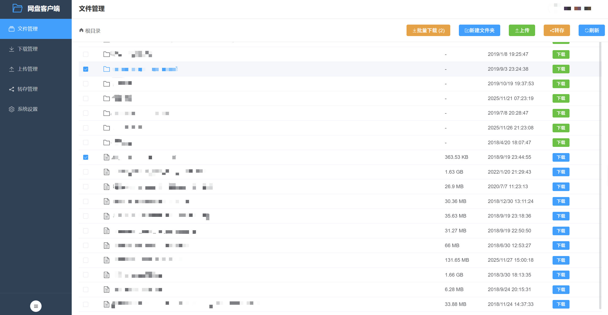

浏览和管理百度网盘中的文件和目录，支持目录导航、文件信息查看和下载操作。

#### 文件管理（加密文件显示）
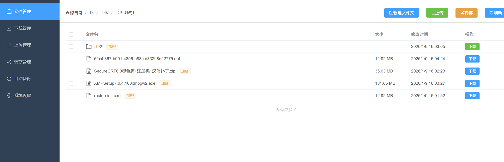

加密文件和文件夹在文件列表中会显示"加密"标签，并自动还原显示原始文件名（通过查询本地加密映射表）。下载加密文件时会自动解密并恢复原始文件名。

#### 下载管理


实时查看下载进度，支持多任务并发下载，显示下载速度、进度百分比和剩余时间。

#### 下载对话框

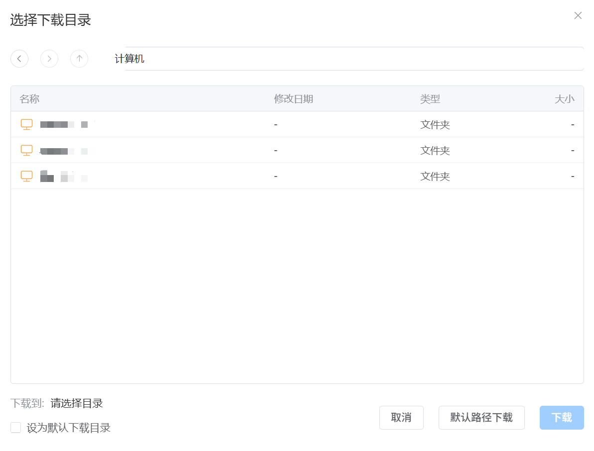

通过下载对话框确认下载任务的保存路径和任务信息，并可根据需要调整下载参数。

#### 上传管理


集中查看所有上传任务，实时展示进度、速度和剩余时间，支持暂停、继续和删除操作。

#### 转存管理

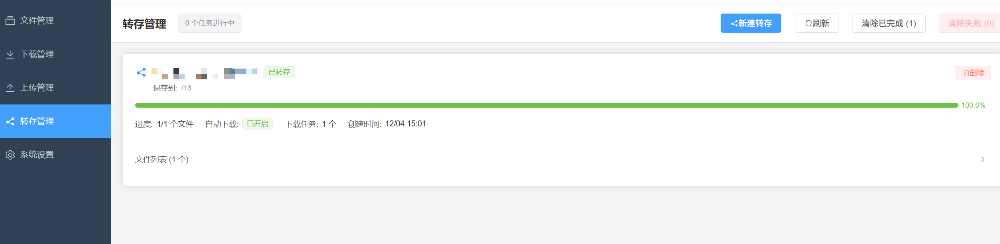

在转存管理页面集中查看所有分享链接转存任务的进度和状态，支持查看成功、失败任务，并进行删除等操作。

#### 转存弹窗


通过转存弹窗输入或粘贴百度网盘分享链接和提取码，选择转存目标目录，并发起转存任务。

#### 文件上传对话框（本地文件资源管理器）
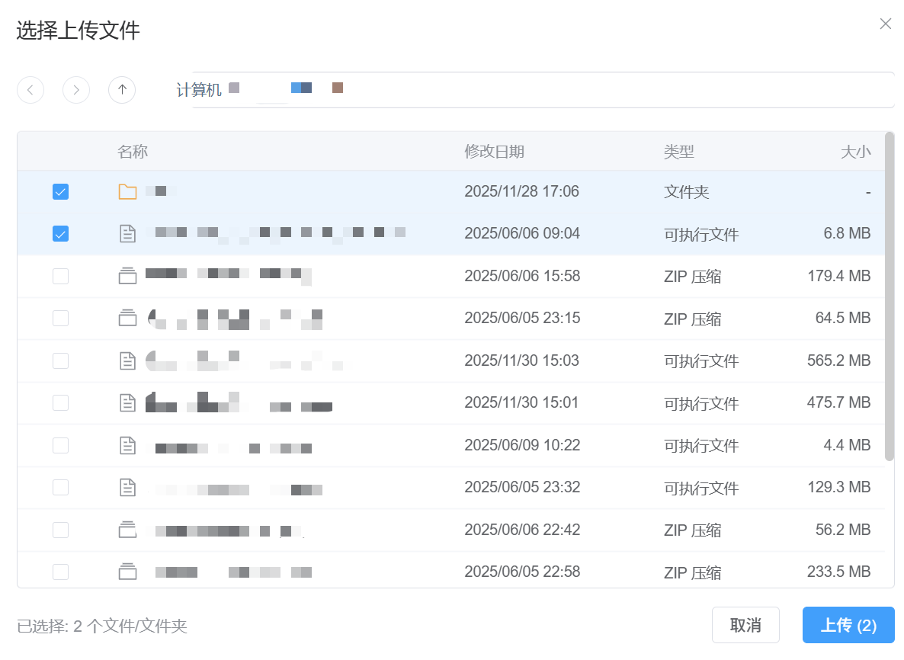

通过内置的本地文件资源管理器选择文件或文件夹上传，支持目录导航、空态/错误态提示和分页加载。

#### 上传相关系统设置
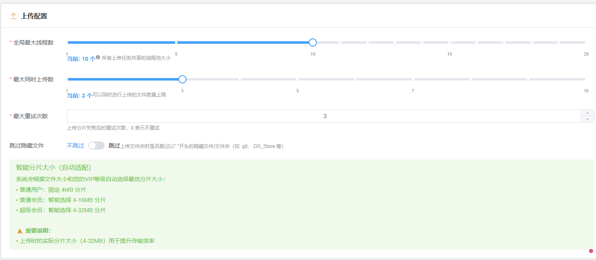

在系统设置中配置上传相关参数（如并发策略等），与下载配置统一管理。

#### 转存设置


在转存设置中配置与分享链接转存相关的参数，例如默认转存目录、是否自动在转存完成后创建下载任务等。

#### 系统设置
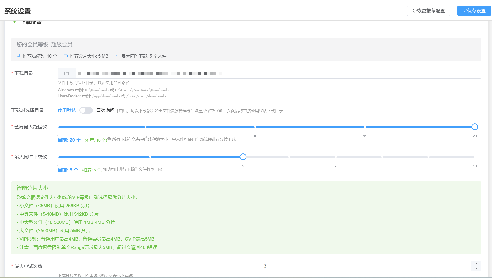

配置服务器参数和下载选项，包括线程数、分片大小、下载目录等。

#### 自动备份管理
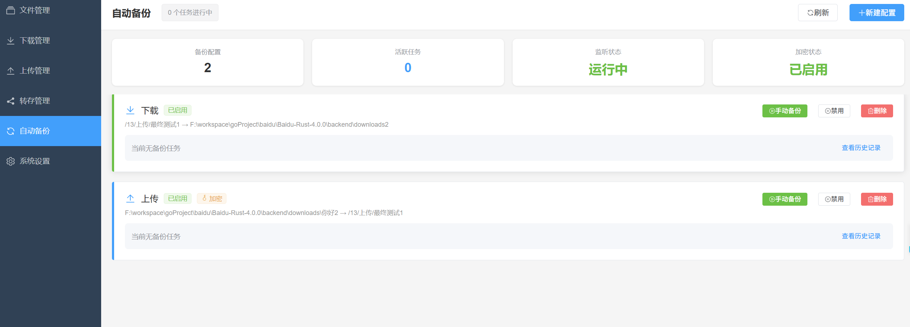

集中管理所有备份配置，查看备份状态、活跃任务数和加密状态，支持手动触发备份、禁用/启用和删除操作。

#### 自动备份设置
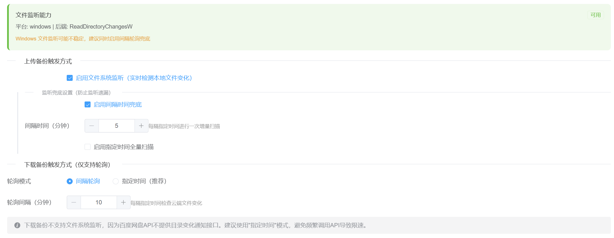

配置备份触发方式，包括文件系统监听（实时检测文件变化）、轮询兜底设置和下载备份轮询模式。

#### 加密设置
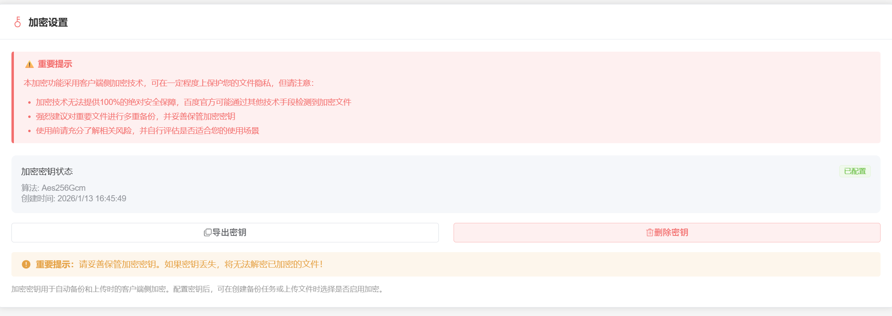

在系统设置中配置客户端侧加密，支持生成、导出和删除加密密钥，使用 AES-256-GCM 算法保护文件隐私。

#### Web 访问认证设置
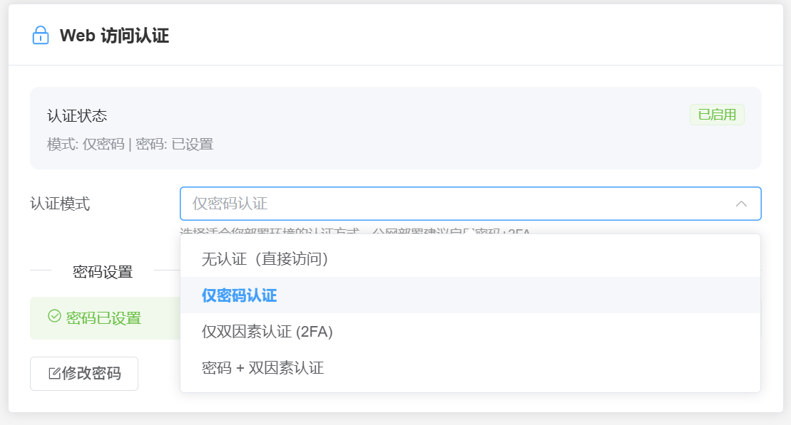

在系统设置中配置 Web 访问认证，支持密码保护和 TOTP 双因素认证，防止未授权访问 Web 界面。

</details>

### 使用 Docker（推荐）

#### 方式一：使用预构建镜像（最简单）

**使用 docker run（推荐）**：

```bash
# 1. 创建必要的目录
mkdir -p baidupcs-rust/{config,downloads,data,logs,wal}
cd baidupcs-rust

# 2. 运行容器（使用预构建镜像）
docker run -d \
  --name baidu-netdisk-rust \
  -p 18888:18888 \
  -v $(pwd)/config:/app/config \
  -v $(pwd)/downloads:/app/downloads \
  -v $(pwd)/data:/app/data \
  -v $(pwd)/logs:/app/logs \
  -v $(pwd)/wal:/app/wal \
  --restart unless-stopped \
  komorebicarry/baidupcs-rust:latest

# 3. 访问应用
open http://localhost:18888
```

**使用 docker-compose**：

```bash
# 1. 创建必要的目录
mkdir -p baidupcs-rust/{config,downloads,data,logs,wal}
cd baidupcs-rust

# 2. 下载 docker-compose 配置文件
# 从项目仓库下载 docker-compose.image.yml 文件

# 3. 启动服务（使用预构建镜像）
docker-compose -f docker-compose.image.yml up -d

# 4. 访问应用
open http://localhost:18888
```

#### 方式二：从源码构建

```bash
# 1. 克隆项目
git clone https://github.com/komorebiCarry/BaiduPCS-Rust.git
cd BaiduPCS-Rust

# 2. 构建并启动服务
docker-compose up -d

# 3. 访问应用
open http://localhost:18888
```

<details>
<summary><b>📋 Docker 详细说明</b>（点击展开）</summary>

**说明**：
- Docker 容器内，后端 API 服务和前端静态文件服务运行在同一个进程中
- 只需要暴露一个端口（18888）即可访问完整应用
- 前端页面和 API 调用都通过 `http://localhost:18888` 访问
- 前端在容器内部通过 `http://localhost:18888/api/v1` 调用后端 API
- **挂载目录说明**：
    - `config`：配置文件目录，包含以下重要文件：
        - `encryption.json`：加密密钥文件
        - `baidu-pcs.db`：SQLite 数据库（历史记录、加密映射表等）
        - `autobackup_configs.json`：自动备份配置
    - `downloads`：下载文件保存目录
    - `data`：会话数据目录（登录信息、会话持久化）
    - `logs`：日志文件目录（应用运行日志，支持滚动）
    - `wal`：WAL 目录（任务持久化数据，支持断点恢复）
- ⚠️ **重要提示**：如果启用了客户端侧加密功能，请务必备份以下文件：
    - `config/encryption.json`：加密密钥，**丢失后将无法解密已加密的文件**！
    - `config/baidu-pcs.db`：包含加密文件映射表，用于解密时查找原始文件名
- 预构建镜像自动发布在以下位置：
    - [GitHub Container Registry](https://github.com/komorebiCarry/BaiduPCS-Rust/pkgs/container/baidupcs-rust) - `ghcr.io/komorebicarry/baidupcs-rust:latest`（推荐，无需额外注册）
    - [Docker Hub](https://hub.docker.com/r/komorebicarry/baidupcs-rust) - `komorebicarry/baidupcs-rust:latest`（可选，需要配置 secrets）
- 当创建 Git 标签（如 `v1.0.0`）时，GitHub Actions 会自动构建并推送 Docker 镜像
- **Linux 用户推荐使用 Docker Hub 镜像**（更通用，无需登录）：`komorebicarry/baidupcs-rust:latest`
- **如果镜像拉取较慢**，也可以从 [GitHub Releases](https://github.com/komorebiCarry/BaiduPCS-Rust/releases) 页面直接下载 Docker 镜像文件（`BaiduPCS-Rust-{版本号}-docker.tar.gz`），然后使用以下命令加载：
  ```bash
  # 下载镜像文件后，加载镜像
  docker load < BaiduPCS-Rust-v1.7.0-docker.tar.gz
  
  # 加载后可以使用镜像运行容器
  docker run -d \
    --name baidu-netdisk-rust \
    -p 18888:18888 \
    -v $(pwd)/config:/app/config \
    -v $(pwd)/downloads:/app/downloads \
    -v $(pwd)/data:/app/data \
    -v $(pwd)/logs:/app/logs \
    -v $(pwd)/wal:/app/wal \
    --restart unless-stopped \
    baidupcs-rust:v1.7.0
  ```

</details>

### 手动安装

#### 前提条件

- Rust 1.75+
- Node.js 18+
- npm 或 pnpm

#### 后端

```bash
cd backend
cargo build --release
cargo run --release
```

#### 前端

```bash
cd frontend
npm install
npm run build
# 或者开发模式
npm run dev
```

访问 http://localhost:5173（开发模式）或 http://localhost:18888（生产模式）

---

## 📝 平台支持说明

### 测试平台

本项目主要在以下平台进行测试：

- ✅ **Windows** - 主要开发和测试平台
- ✅ **Docker** - 容器化部署，支持跨平台运行

### 其他平台

虽然项目理论上支持 Linux、macOS 等其他平台，但**目前不会进行主动测试**。如果您在其他平台使用遇到问题，欢迎提交 Issue。

### 多平台打包

项目使用 **GitHub Actions** 进行自动化多平台构建和打包，支持：

- Windows (x86_64)
- Linux (x86_64, ARM64)
- macOS (x86_64, ARM64)

预编译的二进制文件可在 [Releases](https://github.com/komorebiCarry/BaiduPCS-Rust/releases) 页面下载。

---

## 🛠️ 技术栈

### 后端

- **语言**: Rust 1.75+
- **框架**: Axum 0.7（Web 框架）
- **异步运行时**: Tokio
- **HTTP 客户端**: Reqwest
- **序列化**: Serde + Serde JSON
- **日志**: Tracing

### 前端

- **框架**: Vue 3（Composition API）
- **语言**: TypeScript 5
- **构建工具**: Vite 6
- **UI 库**: Element Plus
- **状态管理**: Pinia
- **路由**: Vue Router 4
- **HTTP 客户端**: Axios

### 部署

- **容器化**: Docker + Docker Compose
- **多阶段构建**: 优化镜像大小
- **健康检查**: 自动故障检测

---

<details>
<summary><b>📁 项目结构</b>（点击展开）</summary>

```
BaiduPCS-Rust/
├── backend/                # Rust 后端
│   ├── src/
│   │   ├── auth/          # 认证模块
│   │   ├── netdisk/       # 网盘 API
│   │   ├── downloader/    # 下载引擎
│   │   ├── uploader/      # 上传引擎
│   │   ├── transfer/      # 转存模块（分享链接转存）
│   │   ├── common/        # 公共模块（CDN刷新检测等）
│   │   ├── filesystem/    # 文件系统访问模块
│   │   ├── config/        # 配置管理
│   │   ├── server/        # Web 服务器
│   │   └── sign/          # 签名算法
│   └── Cargo.toml
├── frontend/               # Vue 3 前端
│   ├── src/
│   │   ├── views/         # 页面组件
│   │   ├── components/    # 公共组件
│   │   ├── api/           # API 封装
│   │   ├── stores/        # Pinia 状态
│   │   └── router/        # 路由配置
│   └── package.json
├── config/                 # 配置文件示例
│   ├── app.toml.example
│   └── config.example.json
├── scripts/                # 构建脚本
│   ├── build.sh
│   ├── deploy.sh
│   ├── dev.sh
│   └── test.sh
├── tests/                  # 测试脚本
│   ├── integration_test.sh
│   └── performance_test.sh
├── Dockerfile              # Docker 镜像
├── docker-compose.yml      # 生产环境
├── docker-compose.dev.yml  # 开发环境
├── rustfmt.toml            # Rust 代码格式配置
├── .gitignore              # Git 忽略文件
├── LICENSE                 # Apache License 2.0
└── README.md               # 项目说明
```

</details>

---

## ⚙️ 配置

配置文件位于 `backend/config/app.toml`:

```toml
[server]
host = "127.0.0.1"
port = 8080
cors_origins = ["*"]

[download]
download_dir = "downloads"
max_global_threads = 10
max_concurrent_tasks = 2
chunk_size_mb = 10
max_retries = 3
```

<details>
<summary><b>📋 配置参数说明</b>（点击展开）</summary>

#### 下载配置参数

- **`max_global_threads`**: 全局最大线程数（所有下载任务共享的并发分片数）
- **`max_concurrent_tasks`**: 最大同时下载文件数
- **`chunk_size_mb`**: 每个分片的大小（单位: MB）
- **`max_retries`**: 下载失败后的最大重试次数

#### 普通用户配置建议

普通用户请将**全局最大线程数**（`max_global_threads`）和**最大同时下载数**（`max_concurrent_tasks`）都设置为 1。

```toml
[download]
max_global_threads = 1
max_concurrent_tasks = 1
```

**⚠️ 注意**：调大线程数只会在短时间内提升下载速度，且极易很快触发限速，导致几小时至几天内账号在各客户端都接近 0 速。

#### SVIP 用户配置建议

SVIP 用户建议**全局最大线程数**（`max_global_threads`）设置为 10 以上，根据实际带宽可调大，但不建议超过 20。可以配合**最大同时下载数**（`max_concurrent_tasks`）调整，**注意最大同时下载数越大不代表速度越快**。

```toml
[download]
max_global_threads = 10    # 建议 10-20
max_concurrent_tasks = 2    # 可根据需求调整
```

</details>

---

## 🧪 测试

```bash
# 运行所有测试
./scripts/test.sh

# 后端测试
cd backend
cargo test

# 集成测试
./tests/integration_test.sh

# 性能测试
./tests/performance_test.sh
```

---

## 📈 性能指标

| 指标 | 数值 |
|------|------|
| Docker 镜像大小 | ~150MB |
| 启动时间 | 5-10 秒 |
| 内存占用（空闲） | 100-200MB |
| 内存占用（下载） | 200-500MB |
| 并发下载分片 | 最多 16 个 |

---

## 🗺️ 路线图

- [x] ✅ 基础架构
- [x] ✅ 认证模块（二维码登录）
- [x] ✅ 文件浏览
- [x] ✅ 下载引擎（多线程 + 断点续传）
- [x] ✅ Web 服务器（RESTful API）
- [x] ✅ 前端界面（Vue 3）
- [x] ✅ Docker 部署
- [x] ✅ 文件夹下载（目录下载）
- [x] ✅ 批量下载（多文件选择下载）
- [x] ✅ 批量上传（多文件/文件夹上传）
- [x] ✅ 上传功能
- [x] ✅ 百度网盘新建文件夹功能（⚠️ 可能需要重新登入才可使用）
- [x] ✅ CDN链接刷新三层检测机制（速度异常检测、线程停滞检测、定时强制刷新）
- [x] ✅ 转存分享链接功能
- [x] ✅ 上传下载最近目录记忆
- [x] ✅ 下载文件资源管理器
- [x] ✅ 任务持久化
- [x] ✅ WebSocket 实时推送与心跳/重连
- [x] ✅ 日志持久化与滚动
- [x] ✅ 移动端适配
- [x] ✅ 自动备份
- [x] ✅ 客户端侧加密（支持普通上传和自动备份）
- [x] ✅ Web 访问认证（密码保护 + TOTP 双因素认证）
- [x] ✅ 离线下载功能（支持 HTTP/HTTPS/磁力链接/ed2k，自动下载，智能轮询）
- [x] ✅ 网络代理支持（HTTP/SOCKS5 代理，支持认证、测试连接、运行状态监控、自动回退）
- [x] ✅ 批量任务操作（下载/上传任务批量暂停/继续/清除）
- [ ] 📝 下载/上传 SSD 缓冲区（针对 NAS 用户：① 减少 HDD 活跃时间，让硬盘更多休眠；② 提升传输效率，仅网速 > 磁盘速度时有效）

---

## 🤝 贡献

欢迎贡献代码！请遵循以下步骤：

1. Fork 本仓库
2. 创建特性分支 (`git checkout -b feature/AmazingFeature`)
3. 提交更改 (`git commit -m 'Add some AmazingFeature'`)
4. 推送到分支 (`git push origin feature/AmazingFeature`)
5. 开启 Pull Request

### 开发规范

- **Rust**: 遵循 Rust 官方代码风格（使用 `cargo fmt` 和 `cargo clippy`）
- **TypeScript**: 遵循 Vue 3 最佳实践
- **提交信息**: 使用清晰的提交信息

---

## 📄 许可证

本项目采用 Apache License 2.0 许可证 - 详见 [LICENSE](LICENSE) 文件

---

## ⚠️ 免责声明

本项目仅供学习和研究使用，请勿用于商业用途。使用本工具产生的任何问题与本项目无关。

---

## 🙏 致谢

- [qjfoidnh/BaiduPCS-Go](https://github.com/qjfoidnh/BaiduPCS-Go) - 本项目的重要参考
- [GangZhuo/BaiduPCS](https://github.com/GangZhuo/BaiduPCS) - 原始项目灵感来源
- [Rust 社区](https://www.rust-lang.org/)
- [Vue.js 社区](https://vuejs.org/)
- [Element Plus](https://element-plus.org/)

---

<div align="center">

**⭐ 如果这个项目对你有帮助，请给一个 Star！**

Made with ❤️ by Rust + Vue 3

</div>
